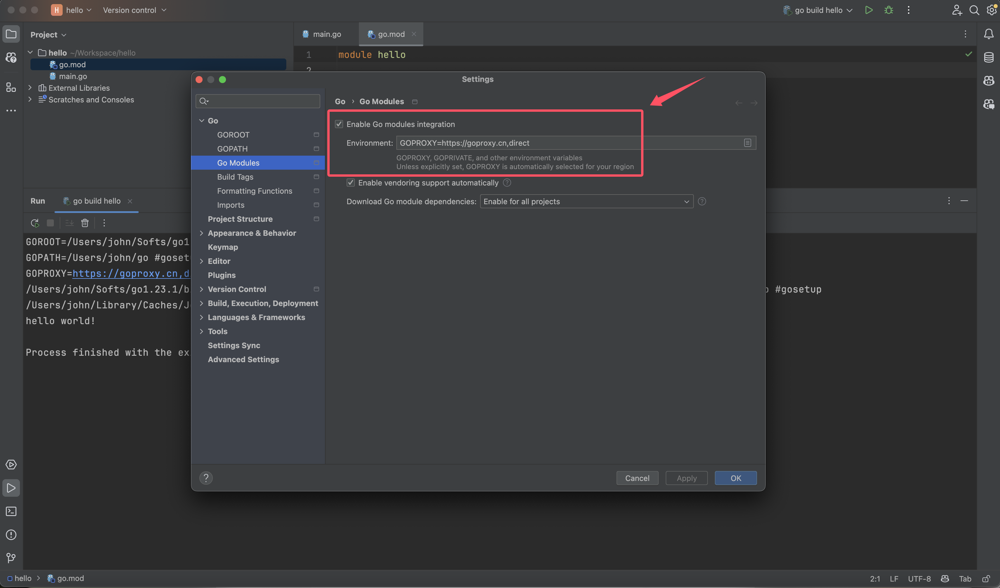

`Go Module` 是从 Go 版本 `1.11.1` 开始官方提供的包管理工具，用于解决`Go`项目的包管理及依赖，类似于`PHP`的 `composer`、`Nodejs`的 `npm`。

本章节会对 `Go Module` 的一些常用的实用的命令/设置进行介绍，更详细的介绍请查看官方文档： [https://go.dev/wiki/Modules](https://go.dev/wiki/Modules)

## 关于 `go.mod`

`go.mod` 是 Go 项目的依赖描述文件，该文件主要用来描述两个事情：

1. 当前项目名( `module`)是什么。每个项目都应该设置一个名称，当前项目中的包( `package`)可以使用该名称进行相互调用。
2. 当前项目依赖的第三方包名称。项目运行时会自动分析项目中的代码依赖，生成 `go.sum` 依赖分析结果，随后 go 编译器会去下载这些第三方包，然后再编译运行。

我们可以看到之前的 `hello world` 项目下有一个自动生成的 `go.mod` 文件，其内容如下：

```go
module hello
```

其中， `hello` 为当前项目的名称，在我们初始化项目的时候`Goland IDE`自动帮助我们生成了该文件，默认情况下该`module`的名称为目录的名称，该名称可以随意设置。

## 关于GOPROXY

`GOPROXY` 是一个环境变量，用于设置代理地址加速下载依赖或下载自己的私有依赖。

详见 Go 官网说明： [https://go.dev/wiki/Modules](https://go.dev/wiki/Modules#are-there-always-on-module-repositories-and-enterprise-proxies)

常见的公共`GOPROXY`反向代理地址有：
   - [`https://goproxy.cn`](https://goproxy.cn)
   - [`https://goproxy.io`](https://goproxy.io)
   - [`https://mirrors.aliyun.com/goproxy/`](https://developer.aliyun.com/mirror/goproxy)


## 使用 `go.mod`

### 使用 Goland IDE

1. 设置 `Goland` 启用 `Go Module`特性

   

   在下载第三方依赖包时，您需要科学上网。笔者本地设置了一个环境变量`GOPROXY`用于科学上网拉取依赖：

   ```bash
   GOPROXY=https://goproxy.cn
   ```

   如果您本地环境已经有 `VPN` 功能，那么可以忽略 `GOPROXY` 的设置，可以添加`direct` 后缀表示不使用代理。

   ```bash
   GOPROXY=https://goproxy.cn,direct
   ```

2. 手动修改 `go.mod` 文件如下：

   ```go
   module hello

   require github.com/gogf/gf/v2 latest
   ```

   增加 `GoFrame` 框架的依赖，其中 `latest` 表示使用`github.com/gogf/gf/v2`最新版本，`IDE`将会立即去更新下载框架代码。成功后，`IDE`将会修改 `go.mod` 文件并生成 `go.sum` 依赖分析文件。该`go.sum`文件为该项目所有的第三方依赖，通常也应该推送到版本管理仓库中。

3. 随后 `go.mod` 文件被自动更新为：

   ```go
   module hello

   require github.com/gogf/gf/v2 v2.8.1
   ```

   其中 `v2.8.1` 表示`Go Module`检测到的最新框架版本。

### 使用命令行

1. 打开 `Terminal`，在项目根目录下执行:

   ```bash
   go env -w GO111MODULE=on
   go env -w GOPROXY=https://goproxy.cn,direct
   go get -u github.com/gogf/gf/v2
   ```

   推荐使用`go env -w`的方式设置Go的环境变量（其他方式请[参考](https://goproxy.cn/#usage)），以上命令将会使用代理立即下载最新稳定版本的 `GoFrame` 框架。
  

2. 随后 `go.mod` 文件内容被自动更新为：

   ```go
   module hello


   require github.com/gogf/gf/v2 v2.8.1
   ```

   且生成了新的 `go.sum` 依赖分析文件。
