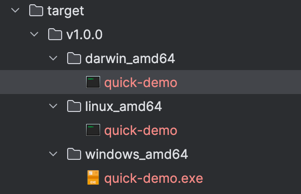

## 使用方式

具体参数，使用 `gf build -h` 查看帮助

仅限于交叉编译使用到 `GoFrame` 框架的项目，支持绝大部分常见系统的直接交叉编译。

## 内置编译变量

`build` 命令自动嵌入编译变量，这些变量用户可自定义，并且在运行时通过 `gbuild` 组件获取。使用 `gf build` 的项目将会默认嵌入以下变量（参考 `gf -v`）：

- 当前 `Go` 版本
- 当前 `GoFrame` 版本
- 当前 `Git Commit`（如果存在）
- 当前编译时间

## 编译配置文件

`build` 支持同时从命令行以及配置文件指定编译参数、选项。 `GoFrame` 框架的所有组件及所有生态项目都是使用的同一个配置管理组件，默认的配置文件以及配置使用请参考章节 [配置管理](../核心组件/配置管理/配置管理.md)。以下是一个简单的配置示例供参考：

```yaml
gfcli:
  build:
    name:     "gf"
    arch:     "all"
    system:   "all"
    mod:      "none"
    packSrc:  "resource,manifest"
    version:  "v1.0.0"
    output:   "./bin"
    extra:    ""
```

配置选项的释义同命令行同名选项。

| 名称 | 默认值 | 含义 | 示例 |
| --- | --- | --- | --- |
| `name` | 与程序入口 `go` 文件同名 | 生成的可执行文件名称。如果是 `windows` 平台，那么默认会加上 `.exe` 后缀 | `gf` |
| `arch` | 当前系统架构 | 编译架构，多个以 `,` 号分隔，如果是 `all` 表示编译所有支持架构 | `386,amd64,arm` [更多](https://golang.google.cn/doc/install/source#environment) |
| `system` | `当前系统平台` | 编译平台，多个以 `,` 号分隔，如果是 `all` 表示编译所有支持平台 | `linux,darwin,windows` [更多](https://golang.google.cn/doc/install/source#environment) |
| `path` | `./bin` | 编译可执行文件存储的 **目录地址** | `./bin` |
| `mod` |  | 同 `go build -mod` 编译选项，不常用 | `none` |
| `cgo` | `false` | 是否开启 `CGO`，默认是关闭的。如果开启，那么交叉编译可能会有问题。 |  |
| `packSrc` |  | 需要打包的目录，多个以 `,` 号分隔，生成到 `internal/packed/build_pack_data.go` | `public,template,manifest` |
| `packDst` | `internal/packed/build_pack_data.go` | 打包后生成的 `Go` 文件路径，一般使用相对路径指定到本项目目录中 |  |
| `version` |  | 程序版本，如果指定版本信息，那么程序生成的路径中会多一层以版本名称的目录 | `v1.0.0` |
| `output` |  | 输出的可执行文件路径，当该参数指定时， `name` 和 `path` 参数失效，常用于编译单个可执行文件。 | `./bin/gf.exe` |
| `extra` |  | 额外自定义的编译参数，会直接传递给 `go build` 命令 |  |
| `varMap` |  | 自定义的内置变量键值对，构建的二进制中可以通过 `gbuild` 包获取编译信息。 | ```<br />gfcli:<br />  build:<br />    name:     "gf"<br />    arch:     "all"<br />    system:   "all"<br />    mod:      "none"<br />    cgo:      0<br />    varMap:<br />      k1: v1<br />      k2: v2<br />``` |
| `exitWhenError` | `false` | 当编译发生错误时，立即停止后续执行，并退出编译流程（使用 `os.Exit(1)`） |  |
| `dumpEnv` | `false` | 每次编译之前在终端打印当前编译环境的环境变量信息 |  |
:::tip
编译时的内置变量可以在运行时通过 `gbuild` 包 [构建信息-gbuild](../组件列表/系统相关/构建信息-gbuild.md) 获取。
:::
## 使用示例

```text
$ gf build
2020-12-31 00:35:25.562 start building...
2020-12-31 00:35:25.562 go build -o ./bin/darwin_amd64/gf main.go
2020-12-31 00:35:28.381 go build -o ./bin/freebsd_386/gf main.go
2020-12-31 00:35:30.650 go build -o ./bin/freebsd_amd64/gf main.go
2020-12-31 00:35:32.957 go build -o ./bin/freebsd_arm/gf main.go
2020-12-31 00:35:35.824 go build -o ./bin/linux_386/gf main.go
2020-12-31 00:35:38.082 go build -o ./bin/linux_amd64/gf main.go
2020-12-31 00:35:41.076 go build -o ./bin/linux_arm/gf main.go
2020-12-31 00:35:44.369 go build -o ./bin/linux_arm64/gf main.go
2020-12-31 00:35:47.352 go build -o ./bin/linux_ppc64/gf main.go
2020-12-31 00:35:50.293 go build -o ./bin/linux_ppc64le/gf main.go
2020-12-31 00:35:53.166 go build -o ./bin/linux_mips/gf main.go
2020-12-31 00:35:55.840 go build -o ./bin/linux_mipsle/gf main.go
2020-12-31 00:35:58.423 go build -o ./bin/linux_mips64/gf main.go
2020-12-31 00:36:01.062 go build -o ./bin/linux_mips64le/gf main.go
2020-12-31 00:36:03.502 go build -o ./bin/netbsd_386/gf main.go
2020-12-31 00:36:06.280 go build -o ./bin/netbsd_amd64/gf main.go
2020-12-31 00:36:09.332 go build -o ./bin/netbsd_arm/gf main.go
2020-12-31 00:36:11.811 go build -o ./bin/openbsd_386/gf main.go
2020-12-31 00:36:14.140 go build -o ./bin/openbsd_amd64/gf main.go
2020-12-31 00:36:17.859 go build -o ./bin/openbsd_arm/gf main.go
2020-12-31 00:36:20.327 go build -o ./bin/windows_386/gf.exe main.go
2020-12-31 00:36:22.994 go build -o ./bin/windows_amd64/gf.exe main.go
2020-12-31 00:36:25.795 done!
```
## 减少可执行文件的大小
在实际开发过程中如果使用`k8s`和`docker`进行发布部署，且集群规模较大，那么内网带宽以及镜像大小会降低`k8s`拉区镜像的速度。

为了解决这个问题我们通常需要裁剪`docker`基础镜像以及编译更小的可执行文件，如何剪裁制作更小`docker`基础镜像请根据实际项目进行调整。

这里介绍下最常用的减少可执行文件的两种常规做法。

最常用的两种方法：
- 移除调试信息
- upx压缩可执行文件
### 移除调试信息
我们以`gf`项目中的[quick-demo](https://github.com/gogf/quick-demo)项目为例演示，使用如下编译参数。
```yaml
gfcli:
  build:
    name: "quick-demo"
    arch: "amd64"
    system: "linux,darwin,windows"
    packSrc: "resource,manifest"
    version: "v1.0.0"
    path: "target"
```

`gf build`编译后产生如下可执行文件，三个可执行文件的大小都是21M。



三个可执行文件的大小都是21M。然后我们增加编译参数`extra: "-ldflags=\"-s -w\""`

- `-s`: 忽略符号表达式和调试信息
- `-w`: 忽略DWARFv3调试信息，使用此选项后无法使用gdb进行调试

```yaml
gfcli:
  build:
    name: "quick-demo"
    arch: "amd64"
    system: "linux,darwin,windows"
    packSrc: "resource,manifest"
    version: "v1.0.0"
    path: "target"
    extra: "-ldflags=\"-s -w\""
```
重新编译后可执行文件的大小降低至`15M`且可以正常启动。

### upx压缩可执行文件
`UPX 是一种高级可执行文件压缩工具。UPX 通常可以将程序和 DLL 的文件大小减少约 50%-70%，从而减少磁盘空间、网络负载时间、下载时间以及其他分发和存储成本。`

在 `windows` 和 `linux` 可以下载安装包或者使用对应的包管理器安装。

在`macos`上我们可以通过`brew install upx`安装`upx`。

`UPX` 有许多参数，其中最重要的是压缩比，范围从 1 到 13, 1 代表最低压缩比，13 代表最高压缩比。


```shell
$ brew install upx
```
```shell
$ upx --version
upx 4.2.4
UCL data compression library 1.03
zlib data compression library 1.3.1.1-motley
LZMA SDK version 4.43
doctest C++ testing framework version 2.4.11
Copyright (C) 1996-2024 Markus Franz Xaver Johannes Oberhumer
Copyright (C) 1996-2024 Laszlo Molnar
Copyright (C) 2000-2024 John F. Reiser
Copyright (C) 1995-2024 Jean-loup Gailly and Mark Adler
Copyright (C) 1999-2006 Igor Pavlov
Copyright (C) 2016-2023 Viktor Kirilov
UPX comes with ABSOLUTELY NO WARRANTY; for details type 'upx -L'.
```
```shell
$ upx --help                    
                       Ultimate Packer for eXecutables
                          Copyright (C) 1996 - 2024
UPX 4.2.4       Markus Oberhumer, Laszlo Molnar & John Reiser    May 9th 2024

Usage: upx [-123456789dlthVL] [-qvfk] [-o file] file..

Commands:
  -1     compress faster                   -9    compress better
  --best compress best (can be slow for big files)
  -d     decompress                        -l    list compressed file
  -t     test compressed file              -V    display version number
  -h     give this help                    -L    display software license

Options:
  -q     be quiet                          -v    be verbose
  -oFILE write output to 'FILE'
  -f     force compression of suspicious files
  --no-color, --mono, --color, --no-progress   change look

Compression tuning options:
  --lzma              try LZMA [slower but tighter than NRV]
  --brute             try all available compression methods & filters [slow]
  --ultra-brute       try even more compression variants [very slow]

Backup options:
  -k, --backup        keep backup files
  --no-backup         no backup files [default]

Overlay options:
  --overlay=copy      copy any extra data attached to the file [default]
  --overlay=strip     strip any extra data attached to the file [DANGEROUS]
  --overlay=skip      don't compress a file with an overlay

File system options:
  --force-overwrite   force overwrite of output files
  --link              preserve hard links (Unix only) [USE WITH CARE]
  --no-link           do not preserve hard links but rename files [default]
  --no-mode           do not preserve file mode (aka permissions)
  --no-owner          do not preserve file ownership
  --no-time           do not preserve file timestamp

Options for djgpp2/coff:
  --coff              produce COFF output [default: EXE]

Options for dos/com:
  --8086              make compressed com work on any 8086

Options for dos/exe:
  --8086              make compressed exe work on any 8086
  --no-reloc          put no relocations in to the exe header

Options for dos/sys:
  --8086              make compressed sys work on any 8086

Options for ps1/exe:
  --8-bit             uses 8 bit size compression [default: 32 bit]
  --8mib-ram          8 megabyte memory limit [default: 2 MiB]
  --boot-only         disables client/host transfer compatibility
  --no-align          don't align to 2048 bytes [enables: --console-run]

Options for watcom/le:
  --le                produce LE output [default: EXE]

Options for win32/pe, win64/pe & rtm32/pe:
  --compress-exports=0    do not compress the export section
  --compress-exports=1    compress the export section [default]
  --compress-icons=0      do not compress any icons
  --compress-icons=1      compress all but the first icon
  --compress-icons=2      compress all but the first icon directory [default]
  --compress-icons=3      compress all icons
  --compress-resources=0  do not compress any resources at all
  --keep-resource=list    do not compress resources specified by list
  --strip-relocs=0        do not strip relocations
  --strip-relocs=1        strip relocations [default]

Options for linux/elf:
  --preserve-build-id     copy .gnu.note.build-id to compressed output

file..   executables to (de)compress

This version supports:
    amd64-darwin.dylib                   dylib/amd64
    amd64-darwin.macho                   macho/amd64
    amd64-linux.elf                      linux/amd64
    amd64-linux.kernel.vmlinux           vmlinux/amd64
    amd64-win64.pe                       win64/pe
    arm-darwin.macho                     macho/arm
    arm-linux.elf                        linux/arm
    arm-linux.kernel.vmlinux             vmlinux/arm
    arm-linux.kernel.vmlinuz             vmlinuz/arm
    arm-wince.pe                         wince/arm
    arm64-darwin.macho                   macho/arm64
    arm64-linux.elf                      linux/arm64
    armeb-linux.elf                      linux/armeb
    armeb-linux.kernel.vmlinux           vmlinux/armeb
    fat-darwin.macho                     macho/fat
    i086-dos16.com                       dos/com
    i086-dos16.exe                       dos/exe
    i086-dos16.sys                       dos/sys
    i386-bsd.elf.execve                  bsd.exec/i386
    i386-darwin.macho                    macho/i386
    i386-dos32.djgpp2.coff               djgpp2/coff
    i386-dos32.tmt.adam                  tmt/adam
    i386-dos32.watcom.le                 watcom/le
    i386-freebsd.elf                     freebsd/i386
    i386-linux.elf                       linux/i386
    i386-linux.elf.execve                linux.exec/i386
    i386-linux.elf.shell                 linux.sh/i386
    i386-linux.kernel.bvmlinuz           bvmlinuz/i386
    i386-linux.kernel.vmlinux            vmlinux/i386
    i386-linux.kernel.vmlinuz            vmlinuz/i386
    i386-netbsd.elf                      netbsd/i386
    i386-openbsd.elf                     openbsd/i386
    i386-win32.pe                        win32/pe
    m68k-atari.tos                       atari/tos
    mips-linux.elf                       linux/mips
    mipsel-linux.elf                     linux/mipsel
    mipsel.r3000-ps1                     ps1/exe
    powerpc-darwin.macho                 macho/ppc32
    powerpc-linux.elf                    linux/ppc32
    powerpc-linux.kernel.vmlinux         vmlinux/ppc32
    powerpc64-linux.elf                  linux/ppc64
    powerpc64le-linux.elf                linux/ppc64le
    powerpc64le-linux.kernel.vmlinux     vmlinux/ppc64le

UPX comes with ABSOLUTELY NO WARRANTY; for details visit https://upx.github.io

```

我们使用 `--brute` 参数进行压，这是尽最大可能压缩所以压缩时间较长请耐心等待，实际使用过程中请按照实际情况选择合适的压缩比。
```shell
upx --brute quick-demo
```
```shell
Compression tuning options:
    --lzma              try LZMA [slower but tighter than NRV]
    --brute             try all available compression methods & filters [slow]
    --ultra-brute       try even more compression variants [very slow]
```
如果目标可执行文件是`macos`平台的可执行文件，请使用`upx --brute --force-macos quick-demo`
```shell
$ upx --brute --force-macos quick-demo 
                       Ultimate Packer for eXecutables
                          Copyright (C) 1996 - 2024
UPX 4.2.4       Markus Oberhumer, Laszlo Molnar & John Reiser    May 9th 2024

        File size         Ratio      Format      Name
   --------------------   ------   -----------   -----------
  15671168 ->   4784144   30.53%   macho/amd64   quick-demo                    

Packed 1 file.

```
最终`quick-demo`可执行文件的压缩结果是`4.6M`且可以正常启动运行。

我们成功通过去除调试信息和使用`upx`进行压缩将可执行文件的大小从`21M`压缩至 `4.6M`，压缩效果非常明显，体积减少了`78%`。

结合以上两种方式我们可以减少磁盘空间、网络负载时间、下载时间以及其他分发和存储成本。


