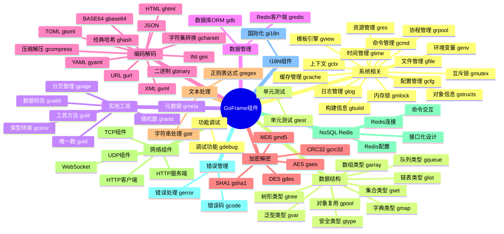

模块列表包含绝大部分框架的核心模块以及社区模块介绍文档。

## 组件图谱

以下是GoFrame框架核心组件的整体架构图谱,展示了各个组件分类及其包含的功能模块:

## 核心模块

`GoFrame` 提供了一些基础的、常用的模块，简单、易用和轻量级，并保持极少的外部依赖，这些模块由 `gf` 主仓库细致维护。

## 社区模块

社区模块主要由社区贡献并维护，大部分也是由 `gf` 主仓库的贡献者提供及维护，存放于 `gogf` 空间下，与 `gf` 主仓库处于同一级别。有的社区模块是从 `gf` 主仓库中剥离出来单独维护的模块，这些模块并不是特别常用，或者对外部依赖较重。

目前社区模块的文档未收录，社区模块使用方法请具体查看源码 `README.MD` 文件，由于社区模块大都是核心模块的具体接口具体，因此也可以查看相关联的核心模块文档。

## 相关文档

import DocCardList from '@theme/DocCardList';

<DocCardList />