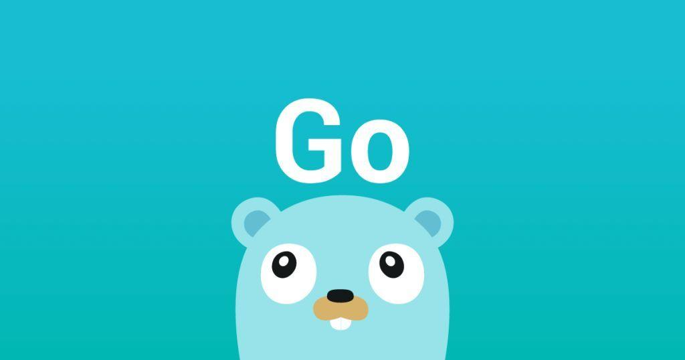

Migrated from the old official website community contribution article: https://wiki.goframe.org/pages/viewpage.action?pageId=3673375

Solve problems? Bring problems?

Due to work requirements, I have encountered many development frameworks over the years. While there are numerous Golang development frameworks, they are primarily Web "frameworks". The quotation marks are used here because most "frameworks", from their design and functional positioning, can at best be considered as components. When projects need to use them, developers often have to search for other components elsewhere or build their own. For Web development, these "frameworks" all have complete Web development capabilities with little difference, and they are all secondary encapsulations of the standard library net/http.Server. Due to the large number of frameworks available, I have selected only a few that I have previously evaluated for technical selection, am familiar with, and are currently popular and typical Golang "frameworks". I will make a simple horizontal comparison from the perspective of business project development frameworks, to provide a reference for everyone when selecting a project framework."

## Evaluation Criteria

<table class="relative-table wrapped confluenceTable">
    <tbody>
        <tr>
            <th class="confluenceTh">Criteria</th>
            <th class="confluenceTh">Description</th>
        </tr>
        <tr>
            <td class="confluenceTd"><strong>Basic Introduction</strong></td>
            <td class="confluenceTd">Information sourced from official websites.</td>
        </tr>
        <tr>
            <td class="confluenceTd"><strong>Modular Design</strong></td>
            <td class="confluenceTd">Support for modular plug-and-play design, low coupling between modules, and ability to use components independently.</td>
        </tr>
        <tr>
            <td colspan="1" class="confluenceTd"><strong>Module Completeness</strong></td>
            <td colspan="1" class="confluenceTd">Richness of framework modules and their ability to cover common development needs.</td>
        </tr>
        <tr>
            <td colspan="1" class="confluenceTd"><strong>Ease of Use</strong></td>
            <td colspan="1" class="confluenceTd">Beyond basic usability, focuses on team's ability to adopt quickly and maintain with low cost in the long term.</td>
        </tr>
        <tr>
            <td class="confluenceTd"><strong>Documentation Quality</strong></td>
            <td class="confluenceTd">Reference materials including documentation, videos, examples, and case studies. Local language support is also considered.</td>
        </tr>
        <tr>
            <td colspan="1" class="confluenceTd"><strong>Engineering Completeness</strong></td>
            <td colspan="1" class="confluenceTd">Rapid project integration capability, project standards, design patterns, development toolchain, documentation quality, code readability, and maintainability.</td>
        </tr>
        <tr>
            <td colspan="1" class="confluenceTd"><strong>Development Mode</strong></td>
            <td colspan="1" class="confluenceTd">Supported or officially recommended development patterns.</td>
        </tr>
        <tr>
            <td colspan="1" class="confluenceTd"><strong>Engineering Standards</strong></td>
            <td colspan="1" class="confluenceTd">Development standards including directory structure, design patterns, coding standards, and naming conventions.</td>
        </tr>
        <tr>
            <td class="confluenceTd"><strong>Community Activity</strong></td>
            <td class="confluenceTd">Ease of communication with official team, speed of problem resolution, and bug fix response time.</td>
        </tr>
        <tr>
            <td colspan="1" class="confluenceTd"><strong>Development Toolchain</strong></td>
            <td colspan="1" class="confluenceTd">CLI development tools for project initialization, cross-compilation, code generation, swagger support, hot reloading, etc.</td>
        </tr>
        <tr>
            <td colspan="1" class="confluenceTd"><strong>Web: Performance Tests</strong></td>
            <td colspan="1" class="confluenceTd">
                
Third-party benchmarks from <a class="external-link" href="https://github.com/the-benchmarker/web-frameworks"
                        rel="nofollow">https://github.com/the-benchmarker/web-frameworks</a>.

            </td>
        </tr>
        <tr>
            <td colspan="1" class="confluenceTd"><strong>Web: Route Conflict Handling</strong></td>
            <td colspan="1" class="confluenceTd">Solutions for handling route registration conflicts, which are common in business projects.</td>
        </tr>
        <tr>
            <td colspan="1" class="confluenceTd"><strong>Web: Domain Support</strong></td>
            <td colspan="1" class="confluenceTd">Support for domain binding, including multiple domain capabilities.</td>
        </tr>
        <tr>
            <td colspan="1" class="confluenceTd"><strong>Web: File Service</strong></td>
            <td colspan="1" class="confluenceTd">Static resource serving capabilities.</td>
        </tr>
        <tr>
            <td colspan="1" class="confluenceTd"><strong>Web: Graceful Restart/Shutdown</strong></td>
            <td colspan="1" class="confluenceTd">Ability to restart without affecting ongoing requests and gracefully shut down by completing active requests while refusing new ones.</td>
        </tr>
        <tr>
            <td colspan="1" class="confluenceTd"><strong>ORM</strong></td>
            <td colspan="1" class="confluenceTd">Built-in or third-party ORM support, which is crucial for business projects.</td>
        </tr>
        <tr>
            <td colspan="1" class="confluenceTd"><strong>Session</strong></td>
            <td colspan="1" class="confluenceTd">Session management support, either general-purpose or web-specific.</td>
        </tr>
        <tr>
            <td colspan="1" class="confluenceTd"><strong>I18N Support</strong></td>
            <td colspan="1" class="confluenceTd">Internationalization component support (common but non-core component).</td>
        </tr>
        <tr>
            <td colspan="1" class="confluenceTd"><strong>Configuration Management</strong></td>
            <td colspan="1" class="confluenceTd">Core framework capability for configuration management.</td>
        </tr>
        <tr>
            <td colspan="1" class="confluenceTd"><strong>Logging Component</strong></td>
            <td colspan="1" class="confluenceTd">Core framework capability for logging.</td>
        </tr>
        <tr>
            <td colspan="1" class="confluenceTd"><strong>Data Validation</strong></td>
            <td colspan="1" class="confluenceTd">Core framework capability for data validation.</td>
        </tr>
        <tr>
            <td colspan="1" class="confluenceTd"><strong>Cache Management</strong></td>
            <td colspan="1" class="confluenceTd">Core framework capability for cache management, including memory and Redis support, either built-in or via third-party components.</td>
        </tr>
        <tr>
            <td colspan="1" class="confluenceTd"><strong>Resource Bundling</strong></td>
            <td colspan="1" class="confluenceTd">Support for bundling static resources, configuration files, and other assets into the executable. Framework components automatically support resource discovery.</td>
        </tr>
        <tr>
            <td colspan="1" class="confluenceTd"><strong>Distributed Tracing</strong></td>
            <td colspan="1" class="confluenceTd">Framework capability for distributed tracing, essential for microservice architectures.</td>
        </tr>
        <tr>
            <td colspan="1" class="confluenceTd"><strong>Testing Framework</strong></td>
            <td colspan="1" class="confluenceTd">Unit testing support and standards, whether using standard library or third-party testing frameworks.</td>
        </tr>
        <tr>
            <td colspan="1" class="confluenceTd"><strong>Key Advantages</strong></td>
            <td colspan="1" class="confluenceTd">Notable strengths of the framework.</td>
        </tr>
        <tr>
            <td colspan="1" class="confluenceTd"><strong>Key Disadvantages</strong></td>
            <td colspan="1" class="confluenceTd">Notable limitations or weaknesses.</td>
        </tr>
    </tbody>
</table>

## Horizontal Comparison

- For the comparison parameters below that involve scoring, the maximum score is based on a 10-point scale.
- Items marked with "-" indicate that the feature is not supported or requires third-party plugin support.
- For the features below, if official documentation is available, direct links will be provided. If documentation cannot be found but the author knows the feature exists, it will be briefly noted.
- Different "frameworks" implement features differently, with significant variations in documentation, functionality, and usability. Readers can refer to the links for more details.

<table class="relative-table wrapped confluenceTable">
    <tbody>
        <tr>
            <th> </th>
            <th class="confluenceTh">GoFrame</th>
            <th class="confluenceTh">Beego</th>
            <th colspan="1" class="confluenceTh">Iris</th>
            <th colspan="1" class="confluenceTh">Gin</th>
        </tr>
        <tr>
            <td colspan="1" class="confluenceTd"><strong>Comparison Version</strong></td>
            <td colspan="1" class="confluenceTd">v1.15.2</td>
            <td colspan="1" class="confluenceTd">v1.12.3</td>
            <td colspan="1" class="confluenceTd">v12.0.2</td>
            <td colspan="1" class="confluenceTd">v1.6.3</td>
        </tr>
        <tr>
            <td><strong>Project Type</strong></td>
            <td class="confluenceTd">Open Source (China)</td>
            <td class="confluenceTd">Open Source (China)</td>
            <td colspan="1" class="confluenceTd">Open Source (International)</td>
            <td colspan="1" class="confluenceTd">Open Source (International)</td>
        </tr>
        <tr>
            <td colspan="1" class="confluenceTd"><strong>License</strong></td>
            <td colspan="1" class="confluenceTd">MIT</td>
            <td colspan="1" class="confluenceTd">Apache-2</td>
            <td colspan="1" class="confluenceTd">BSD-3-Clause</td>
            <td colspan="1" class="confluenceTd">MIT</td>
        </tr>
        <tr>
            <td colspan="1" class="confluenceTd"><strong>Framework Type</strong></td>
            <td colspan="1" class="confluenceTd">Modular Framework</td>
            <td colspan="1" class="confluenceTd">Web Framework</td>
            <td colspan="1" class="confluenceTd">Web "Framework"</td>
            <td colspan="1" class="confluenceTd">Web "Framework"</td>
        </tr>
        <tr>
            <td>
                
<strong>Basic Introduction</strong>

            </td>
            <td colspan="1" class="confluenceTd">A comprehensive, easy-to-use, modular, high-quality, high-performance,
                enterprise-level development framework.</td>
            <td colspan="1" class="confluenceTd">The most user-friendly enterprise-level Go application development
                framework.</td>
            <td colspan="1" class="confluenceTd">The fastest growing Go Web framework. Provides complete MVC
                functionality and is future-oriented.</td>
            <td colspan="1" class="confluenceTd">An HTTP Web framework written in Go. It provides Martini-style APIs
                with better performance.</td>
        </tr>
        <tr>
            <td><strong>Project URL</strong></td>
            <td class="confluenceTd">
                
<a class="external-link" href="https://github.com/gogf/gf" rel="nofollow">github.com/gogf/gf</a>

            </td>
            <td class="confluenceTd"><a class="external-link" href="https://github.com/beego/beego"
                    rel="nofollow">github.com/beego/beego</a></td>
            <td colspan="1" class="confluenceTd"><a class="external-link" href="https://github.com/kataras/iris"
                    rel="nofollow">github.com/kataras/iris</a></td>
            <td colspan="1" class="confluenceTd"><a class="external-link" href="https://github.com/gin-gonic/gin"
                    rel="nofollow">github.com/gin-gonic/gin</a></td>
        </tr>
        <tr>
            <td><strong>Official Website</strong></td>
            <td class="confluenceTd"><a class="external-link" href="https://goframe.org/" rel="nofollow">goframe.org</a></td>
            <td class="confluenceTd"><a class="external-link" href="https://beego.me/" rel="nofollow"
                   >beego.me</a></td>
            <td colspan="1" class="confluenceTd"><a class="external-link" href="https://iris-go.com/" rel="nofollow"
                   >iris-go.com</a></td>
            <td colspan="1" class="confluenceTd"><a class="external-link" href="https://gin-gonic.com/"
                    rel="nofollow">gin-gonic.com</a></td>
        </tr>
        <tr>
            <td>
                
<strong>Modular Design</strong>

            </td>
            <td class="confluenceTd">Yes</td>
            <td class="confluenceTd">-</td>
            <td colspan="1" class="confluenceTd">-</td>
            <td colspan="1" class="confluenceTd">-</td>
        </tr>
        <tr>
            <td colspan="1" class="confluenceTd"><strong>Module Completeness</strong></td>
            <td colspan="1" class="confluenceTd">10</td>
            <td colspan="1" class="confluenceTd">6</td>
            <td colspan="1" class="confluenceTd">4</td>
            <td colspan="1" class="confluenceTd">2</td>
        </tr>
        <tr>
            <td>
                
<strong>Ease of Use</strong>

            </td>
            <td colspan="1" class="confluenceTd">9</td>
            <td colspan="1" class="confluenceTd">9</td>
            <td colspan="1" class="confluenceTd">9</td>
            <td colspan="1" class="confluenceTd">10</td>
        </tr>
        <tr>
            <td>
                
<strong>Documentation Completeness</strong>

            </td>
            <td colspan="1" class="confluenceTd">10</td>
            <td colspan="1" class="confluenceTd">8</td>
            <td colspan="1" class="confluenceTd">6</td>
            <td colspan="1" class="confluenceTd">4</td>
        </tr>
        <tr>
            <td><strong>Engineering Completeness</strong></td>
            <td colspan="1" class="confluenceTd">10</td>
            <td colspan="1" class="confluenceTd">8</td>
            <td colspan="1" class="confluenceTd">5</td>
            <td colspan="1" class="confluenceTd">1</td>
        </tr>
        <tr>
            <td><strong>Community Activity</strong></td>
            <td class="confluenceTd">9</td>
            <td class="confluenceTd">10</td>
            <td colspan="1" class="confluenceTd">9</td>
            <td colspan="1" class="confluenceTd">10</td>
        </tr>
        <tr>
            <td><strong>Development Mode</strong></td>
            <td colspan="1" class="confluenceTd"><a class="external-link"
                    href="https://goframe.org/pages/viewpage.action?pageId=1114411" rel="nofollow">Module Import</a>、<a
                    class="external-link" href="https://goframe.org//pages/viewpage.action?pageId=3672442"
                    rel="nofollow">Three-tier Architecture</a>、MVC</td>
            <td colspan="1" class="confluenceTd"><a class="external-link" href="https://beego.me/docs/mvc/"
                    rel="nofollow">MVC</a></td>
            <td colspan="1" class="confluenceTd"><a class="external-link"
                    href="https://www.iris-go.com/docs/#/?id=quick-start" rel="nofollow">MVC</a></td>
            <td colspan="1" class="confluenceTd">-</td>
        </tr>
        <tr>
            <td><strong>Engineering Standards</strong></td>
            <td colspan="1" class="confluenceTd"><a class="external-link"
                    href="https://goframe.org/pages/viewpage.action?pageId=3672442" rel="nofollow">Layered Design</a>,
                <a class="external-link" href="https://goframe.org/pages/viewpage.action?pageId=3672526"
                    rel="nofollow">Object Design</a></td>
            <td colspan="1" class="confluenceTd"><a class="external-link"
                    href="https://beego.me/docs/intro/#beego-%E9%A1%B9%E7%9B%AE%E7%BB%93%E6%9E%84"
                    rel="nofollow">Project Structure</a></td>
            <td colspan="1" class="confluenceTd">-</td>
            <td colspan="1" class="confluenceTd">-</td>
        </tr>
        <tr>
            <td><strong>Development Toolchain</strong></td>
            <td colspan="1" class="confluenceTd"><a class="external-link"
                    href="https://goframe.org/pages/viewpage.action?pageId=1114260" rel="nofollow">gf工具链</a></td>
            <td colspan="1" class="confluenceTd"><a class="external-link" href="https://beego.me/docs/install/bee.md"
                    rel="nofollow">bee工具链</a></td>
            <td colspan="1" class="confluenceTd">-</td>
            <td colspan="1" class="confluenceTd">-</td>
        </tr>
        <tr>
            <td><strong>Web: Performance Test</strong></td>
            <td class="confluenceTd">8</td>
            <td class="confluenceTd">8</td>
            <td colspan="1" class="confluenceTd">8</td>
            <td colspan="1" class="confluenceTd">9</td>
        </tr>
        <tr>
            <td colspan="1" class="confluenceTd"><strong>Web: HTTPS</strong></td>
            <td colspan="1" class="confluenceTd"><a
                    href="https://wiki.goframe.org/pages/viewpage.action?pageId=1114278">HTTPS &amp; TLS</a></td>
            <td colspan="1" class="confluenceTd">Supported</td>
            <td colspan="1" class="confluenceTd"><a class="external-link"
                    href="https://www.iris-go.com/docs/#/?id=custom-http-configuration"
                    rel="nofollow">CustomHttpConfiguration</a></td>
            <td colspan="1" class="confluenceTd">Supported</td>
        </tr>
        <tr>
            <td colspan="1" class="confluenceTd"><strong>Web: HTTP2</strong></td>
            <td colspan="1" class="confluenceTd">-</td>
            <td colspan="1" class="confluenceTd">-</td>
            <td colspan="1" class="confluenceTd">Supported</td>
            <td colspan="1" class="confluenceTd">Supported</td>
        </tr>
        <tr>
            <td><strong>Web: WebSocket</strong></td>
            <td colspan="1" class="confluenceTd"><a
                    href="https://wiki.goframe.org/pages/viewpage.action?pageId=1114298">WebSocket服务</a></td>
            <td colspan="1" class="confluenceTd">Yes</td>
            <td colspan="1" class="confluenceTd">Yes</td>
            <td colspan="1" class="confluenceTd">-</td>
        </tr>
        <tr>
            <td><strong>Web: Group Routing</strong></td>
            <td colspan="1" class="confluenceTd"><a
                    href="https://wiki.goframe.org/pages/viewpage.action?pageId=1114517">Group Route Registration</a></td>
            <td colspan="1" class="confluenceTd"><a class="external-link"
                    href="https://beego.me/docs/mvc/controller/router.md#namespace" rel="nofollow">Namespace</a></td>
            <td colspan="1" class="confluenceTd"><a class="external-link"
                    href="https://www.iris-go.com/docs/#/?id=grouping-routes" rel="nofollow">GroupingRoutes</a></td>
            <td colspan="1" class="confluenceTd">Yes</td>
        </tr>
        <tr>
            <td><strong>Web: Route Conflict Handling</strong></td>
            <td colspan="1" class="confluenceTd">Yes</td>
            <td colspan="1" class="confluenceTd">-</td>
            <td colspan="1" class="confluenceTd">Yes</td>
            <td colspan="1" class="confluenceTd">-</td>
        </tr>
        <tr>
            <td><strong>Web: Domain Support</strong></td>
            <td colspan="1" class="confluenceTd"><a class="external-link"
                    href="https://goframe.org/pages/viewpage.action?pageId=1114155#id-%E5%BC%80%E5%A7%8B%E4%BD%BF%E7%94%A8-%E5%9F%9F%E5%90%8D%E7%BB%91%E5%AE%9A"
                    rel="nofollow">Domain Binding</a></td>
            <td colspan="1" class="confluenceTd">-</td>
            <td colspan="1" class="confluenceTd">-</td>
            <td colspan="1" class="confluenceTd">-</td>
        </tr>
        <tr>
            <td colspan="1" class="confluenceTd"><strong>Web: File Service</strong></td>
            <td colspan="1" class="confluenceTd"><a class="external-link"
                    href="https://goframe.org/pages/viewpage.action?pageId=1114172" rel="nofollow">Static File Service</a></td>
            <td colspan="1" class="confluenceTd"><a class="external-link"
                    href="https://beego.me/docs/quickstart/static.md" rel="nofollow">Static File Handling</a></td>
            <td colspan="1" class="confluenceTd"><a class="external-link"
                    href="https://www.iris-go.com/docs/#/?id=serving-static-files" rel="nofollow">ServingStaticFiles</a></td>
            <td colspan="1" class="confluenceTd">Yes</td>
        </tr>
        <tr>
            <td><strong>Web: Multi-port/Instance</strong></td>
            <td colspan="1" class="confluenceTd"><a class="external-link"
                    href="https://goframe.org/pages/viewpage.action?pageId=1114155#id-%E5%BC%80%E5%A7%8B%E4%BD%BF%E7%94%A8-%E5%A4%9A%E7%AB%AF%E5%8F%A3%E7%9B%91%E5%90%AC"
                    rel="nofollow">Multi-port Listening</a>、<a class="external-link"
                    href="https://goframe.org/pages/viewpage.action?pageId=1114155#id-%E5%BC%80%E5%A7%8B%E4%BD%BF%E7%94%A8-%E5%A4%9A%E5%AE%9E%E4%BE%8B%E6%94%AF%E6%8C%81"
                    rel="nofollow">Multi-instance Support</a></td>
            <td colspan="1" class="confluenceTd">-</td>
            <td colspan="1" class="confluenceTd"><a class="external-link"
                    href="https://www.iris-go.com/docs/#/?id=run-multiple-service-using-iris"
                    rel="nofollow">RunMultipleServiceUsingIris</a></td>
            <td colspan="1" class="confluenceTd">-</td>
        </tr>
        <tr>
            <td><strong>Web: Graceful Restart/Shutdown</strong></td>
            <td colspan="1" class="confluenceTd"><a class="external-link"
                    href="https://goframe.org/pages/viewpage.action?pageId=1114220" rel="nofollow">Graceful Restart Feature</a></td>
            <td colspan="1" class="confluenceTd"><a class="external-link" href="https://beego.me/docs/module/grace.md"
                    rel="nofollow">Hot Upgrade</a></td>
            <td colspan="1" class="confluenceTd"><a class="external-link"
                    href="https://www.iris-go.com/docs/#/?id=graceful-shutdown-or-restart"
                    rel="nofollow">GracefulShutdownOrRestart</a></td>
            <td colspan="1" class="confluenceTd"><a class="external-link"
                    href="https://gin-gonic.com/docs/examples/graceful-restart-or-stop/"
                    rel="nofollow">GracefulRestartOrStop</a></td>
        </tr>
        <tr>
            <td><strong>ORM</strong></td>
            <td colspan="1" class="confluenceTd"><a class="external-link"
                    href="https://goframe.org/pages/viewpage.action?pageId=1114686" rel="nofollow">ORM Documentation</a></td>
            <td colspan="1" class="confluenceTd"><a class="external-link"
                    href="https://beego.me/docs/mvc/model/overview.md" rel="nofollow">ORM Documentation</a></td>
            <td colspan="1" class="confluenceTd">-</td>
            <td colspan="1" class="confluenceTd">-</td>
        </tr>
        <tr>
            <td><strong>Session</strong></td>
            <td colspan="1" class="confluenceTd"><a class="external-link" href="https://goframe.org/display/gf/Session"
                    rel="nofollow">Session</a></td>
            <td colspan="1" class="confluenceTd"><a class="external-link"
                    href="https://beego.me/docs/mvc/controller/session.md" rel="nofollow">Session</a></td>
            <td colspan="1" class="confluenceTd">Yes</td>
            <td colspan="1" class="confluenceTd">-</td>
        </tr>
        <tr>
            <td colspan="1" class="confluenceTd"><strong>I18NSupported</strong></td>
            <td colspan="1" class="confluenceTd"><a class="external-link"
                    href="https://goframe.org/pages/viewpage.action?pageId=1114191" rel="nofollow">I18N</a></td>
            <td colspan="1" class="confluenceTd"><a class="external-link" href="https://beego.me/docs/module/i18n.md"
                    rel="nofollow">I18N</a></td>
            <td colspan="1" class="confluenceTd"><a class="external-link"
                    href="https://www.iris-go.com/docs/#/?id=localization" rel="nofollow">Localization</a></td>
            <td colspan="1" class="confluenceTd">-</td>
        </tr>
        <tr>
            <td><strong>Template Engine</strong></td>
            <td colspan="1" class="confluenceTd"><a class="external-link"
                    href="https://goframe.org/pages/viewpage.action?pageId=1114680" rel="nofollow">Template Engine</a></td>
            <td colspan="1" class="confluenceTd"><a class="external-link"
                    href="https://beego.me/docs/mvc/view/tutorial.md" rel="nofollow">View Design</a></td>
            <td colspan="1" class="confluenceTd"><a class="external-link"
                    href="https://www.iris-go.com/docs/#/?id=template-rendering" rel="nofollow">TemplateRendering</a></td>
            <td colspan="1" class="confluenceTd"><a class="external-link"
                    href="https://gin-gonic.com/docs/examples/html-rendering/" rel="nofollow">HtmlRendering</a></td>
        </tr>
        <tr>
            <td><strong>Configuration Management</strong></td>
            <td colspan="1" class="confluenceTd"><a class="external-link"
                    href="https://goframe.org/pages/viewpage.action?pageId=1114668" rel="nofollow">Configuration Management</a></td>
            <td colspan="1" class="confluenceTd"><a class="external-link"
                    href="https://beego.me/docs/mvc/controller/config.md" rel="nofollow">Parameter Configuration</a></td>
            <td colspan="1" class="confluenceTd">-</td>
            <td colspan="1" class="confluenceTd"><a class="external-link"
                    href="https://gin-gonic.com/docs/examples/custom-http-config/" rel="nofollow">CustomHttpConfig</a></td>
        </tr>
        <tr>
            <td><strong>Logging Component</strong></td>
            <td colspan="1" class="confluenceTd"><a class="external-link"
                    href="https://goframe.org/pages/viewpage.action?pageId=1114673" rel="nofollow">Logging Component</a></td>
            <td colspan="1" class="confluenceTd"><a class="external-link"
                    href="https://beego.me/docs/mvc/controller/logs.md" rel="nofollow">Logging</a></td>
            <td colspan="1" class="confluenceTd">-</td>
            <td colspan="1" class="confluenceTd">-</td>
        </tr>
        <tr>
            <td><strong>Data Validation</strong></td>
            <td colspan="1" class="confluenceTd"><a class="external-link"
                    href="https://goframe.org/pages/viewpage.action?pageId=1114678" rel="nofollow">Data Validation</a></td>
            <td colspan="1" class="confluenceTd"><a class="external-link"
                    href="https://beego.me/docs/mvc/controller/validation.md" rel="nofollow">Form Data Validation</a></td>
            <td colspan="1" class="confluenceTd">-</td>
            <td colspan="1" class="confluenceTd"><a class="external-link"
                    href="https://gin-gonic.com/docs/examples/custom-validators/" rel="nofollow">CustomValidators</a></td>
        </tr>
        <tr>
            <td><strong>Cache Management</strong></td>
            <td colspan="1" class="confluenceTd"><a class="external-link"
                    href="https://goframe.org/pages/viewpage.action?pageId=1114679" rel="nofollow">Cache Management</a></td>
            <td colspan="1" class="confluenceTd"><a class="external-link" href="https://beego.me/docs/module/cache.md"
                    rel="nofollow">Cache</a></td>
            <td colspan="1" class="confluenceTd">-</td>
            <td colspan="1" class="confluenceTd">-</td>
        </tr>
        <tr>
            <td colspan="1" class="confluenceTd"><strong>Resource Packaging</strong></td>
            <td colspan="1" class="confluenceTd"><a class="external-link"
                    href="https://goframe.org/pages/viewpage.action?pageId=1114671" rel="nofollow">Resource Management</a></td>
            <td colspan="1" class="confluenceTd"><a class="external-link" href="https://beego.me/docs/install/bee.md"
                    rel="nofollow">bee tool bale command</a></td>
            <td colspan="1" class="confluenceTd">-</td>
            <td colspan="1" class="confluenceTd">-</td>
        </tr>
        <tr>
            <td colspan="1" class="confluenceTd"><strong>Service Tracing</strong></td>
            <td colspan="1" class="confluenceTd"><a
                    href="https://wiki.goframe.org/pages/viewpage.action?pageId=3673684">Service Tracing</a></td>
            <td colspan="1" class="confluenceTd">-</td>
            <td colspan="1" class="confluenceTd">-</td>
            <td colspan="1" class="confluenceTd">-</td>
        </tr>
        <tr>
            <td colspan="1" class="confluenceTd"><strong>Testing Framework</strong></td>
            <td colspan="1" class="confluenceTd"><a class="external-link"
                    href="https://goframe.org/pages/viewpage.action?pageId=1114153" rel="nofollow">Unit Testing</a></td>
            <td colspan="1" class="confluenceTd">-</td>
            <td colspan="1" class="confluenceTd"><a class="external-link"
                    href="https://www.iris-go.com/docs/#/?id=testing" rel="nofollow">Testing</a></td>
            <td colspan="1" class="confluenceTd"><a class="external-link" href="https://gin-gonic.com/docs/testing/"
                    rel="nofollow">Testing</a></td>
        </tr>
        <tr>
            <td colspan="1" class="confluenceTd"><strong>Key Advantages</strong></td>
            <td colspan="1" class="confluenceTd">
                GoFrame primarily focuses on engineering and enterprise-level development, with excellent modular design and engineering design principles. For business projects, it provides development standards, project specifications, naming conventions, design patterns, development toolchain, rich modules, high-quality code and documentation, and has an active community. The author is also an experienced PHP developer, making PHP developers transitioning to Go feel at home.
            </td>
            <td colspan="1" class="confluenceTd">
                Beego was one of the earliest open-source frameworks, being the first comprehensive Golang development framework. It has maintained significant influence in the Golang ecosystem, with its author Xiemengjun organizing the influential GopherCN community events for many years. Beego offers rich development modules, is ready to use out of the box, provides MVC-based project structure, development toolchain, and primarily focuses on Web development, though it can also be used for non-Web projects.
            </td>
            <td colspan="1" class="confluenceTd">Iris focuses mainly on Web development, providing a series of functional components for Web development based on the MVC pattern. Iris has developed rapidly this year, evolving from a Web Server component and gradually moving towards Beego's design direction.</td>
            <td colspan="1" class="confluenceTd">Gin focuses on being a lightweight Web Server that is simple and easy to understand. It features well-designed routing and middleware systems and can be considered an enhanced version of the standard net/http.Server with improved routing capabilities. It's a great choice for those who love building their own components.</td>
        </tr>
        <tr>
            <td><strong>Key Disadvantages</strong></td>
            <td class="confluenceTd">Relatively late to open source, takes a passive approach to promotion, currently mainly targets domestic users, and hasn't expanded internationally.</td>
            <td class="confluenceTd">Started early but development has slowed in recent years after the author's entrepreneurial ventures. Non-modular design with heavy reliance on third-party modules.</td>
            <td colspan="1" class="confluenceTd">
                
Claims to have the best performance but results are average. Non-modular design. Has started moving towards Beego's direction in the last two years, but the overall framework capabilities are still incomplete and need improvement.

            </td>
            <td colspan="1" class="confluenceTd">Simple and easy to use functionality, which is both an advantage and a disadvantage.</td>
        </tr>
    </tbody>
</table>

## Experience Sharing

Different scenarios require different choices. Choose the right tool to solve the right problem.

In open source, there's no absolute better or worse. Open source authors sharing their technical achievements in the spirit of open source for learning and use is itself a commendable and valuable contribution.

Finally, I'd like to share my team's experience and the challenges we faced during our transition to the `Golang` technology stack, hoping it can provide some reference for others in their framework selection process.

## Initial Pain Points

Here's some background on our team's transition to the `Golang` technology stack. The main points are:

1.  Initially, our backend team's primary technology stack was `PHP`. Due to business growth requirements, we underwent a microservices transformation. The first version of microservices used `PHP` + `JsonRpc` for communication.
2.  As projects multiplied, the company formed its own `DevOps` team, shifting the underlying deployment to `Docker` + `Kubernetes` container architecture, and introduced the `Golang` technology stack.
3.  Due to several pain points, after comparing `PHP` and `Golang` for a period, the team decided to quickly transition to the `Golang` stack. The main pain points were:
    1.  `PHP` projects had higher overall development and maintenance costs in later stages when business logic became complex. This was mainly due to its excessive flexibility, unstructured variable design, and varying developer skill levels.
    2.  After cloud containerization deployment, `PHP`'s `DevOps` efficiency was too low. Complex `Composer` version management and oversized `Docker` images affected `DevOps` efficiency. In comparison, `Golang` is extremely efficient.
    3.  While the `JsonRpc` communication protocol design offered high interface extensibility and flexibility, it was difficult to quickly determine interface input and output definitions between services, relying solely on documentation and examples for integration and maintenance. Due to the separation of code and documentation, interface documentation often lagged behind interface changes. As services increased, the unstructured communication protocol management further raised the development and maintenance costs of service interfaces.
    4.  The `JsonRpc` communication protocol, essentially based on `HTTP1.x` + `Json`, had low execution efficiency and couldn't be considered a true microservice communication protocol, making it difficult to integrate with mainstream service governance frameworks. In contrast, the `HTTP2.x`-based `gRPC` protocol comes with mature microservice development frameworks and service governance solutions.
    5.  From a business perspective, the migration from `PHP` to `Golang` stack presented an opportunity for technical reconstruction, allowing us to review business system design and pay off technical debt during the process.

## Further Pain Points

`Golang` is indeed simple enough, and compared to other interpreted languages, it doesn't have excessive syntactic sugar and language features, which allowed our team to quickly get started and complete the technical reconstruction of some business systems. However, this was followed by more serious pain points. Here are the main ones:

1.  **Too Many Reinvented Wheels:** `Golang` is so simple that our team members unleashed their long-suppressed creative energy, fully embracing the "build and forget" mentality, developing/encapsulating numerous wheels of various sizes. These wheels could meet basic functionalities, such as logging, configuration, caching, etc. However, building a wheel is not just about implementing basic functionality as a half-finished product - it needs to ensure functionality, stability, extensibility, and maintainability. It should be validated through more production practices and requires long-term maintenance and continuous iterative improvements. Otherwise, they are just a collection of mismatched tools. Building wheels might feel good momentarily, but maintenance becomes a nightmare. Even now, we are still painfully working on unifying dozens of these scattered tools across more than `100` `Golang` projects. Of course, this issue is also closely related to organizational structure and team management.
2.  **Lack of Systematic Approach:**
    1.  We firmly believed in the principle of one `package` doing one thing, and specifically used **single repository packages** for package management, meaning each `package` was maintained as an independent `git` repository. In reality, there was no necessity for **single repository packages** and such `package` design; instead, independent single repository packages increased the maintenance cost of components and frameworks.
    2.  This single repository package design made it difficult to form a cohesive technical system and establish a unified technical framework for team management. Single repository packages appeared isolated, while building a technical system requires not only establishing standards and specifications but also needs a technical framework for accurate implementation. A systematic, unified technical framework involves at least dozens of basic technical components and cannot be designed in complete isolation. While implementing basic functionality in each `package` is simple, organizing them cohesively is not an easy task. This requires technical managers with deep technical knowledge, vision, and foresight, rather than having the limited perspective of ordinary developers who only focus on individual `packages`.
    3.  This isolated single repository package design provided weak standardization constraints for business projects, as each component could be independently replaced, which exacerbated the issues mentioned in point 1 (we even had several logging components, though they all met basic logging specification requirements). Eventually, our initially proud single repository package design turned into scattered pieces. For example, even adding standardized trace functionality became extremely costly to implement due to the scattered and inconsistent nature of single repository packages.
    4.  Besides making it difficult to establish a technical system and accurately implement technical specifications, each component was also poorly designed in terms of usability. For example, our logging components, cache components, database components, and HTTP/gRPC Server components all needed to interface with configuration management functionality. Single repository packages needed to ensure low coupling design, so developers had to manually read configurations, convert them to target configuration objects, and inject them into corresponding component initialization methods before using these objects in business logic - steps that were repeated across multiple business projects. Actually, `goframe`'s usability design in this aspect is quite good. While each package is independently designed, under a unified technical framework system, it provides a coupled singleton module that encapsulates commonly used objects, automatically implementing configuration reading, configuration object conversion, configuration object injection, and component object initialization. Developers only need to call a single singleton method. This common singleton module became part of our technical framework system, greatly improving the development and maintenance efficiency of business projects.
3.  **Version Inconsistency:** As business projects continued to multiply, the inconsistency in wheel versions became increasingly apparent. What does version inconsistency mean? Here's an example: We have a wheel called `httpClient` with about `10` versions released; we have more than `100` `Golang` projects, with almost every version being used somewhere. When we submit a `bug fix`, it's difficult to get all projects updated. Similar situations exist with other wheels, and we have dozens of various wheels being used independently across different projects.

After reflection and analysis, we concluded the following points:

1.  The team needs a unified technical framework, not a hodgepodge of single repository packages.
2.  We only need to maintain one framework version, not versions of dozens of single repository packages.
3.  Framework components must be modular and loosely coupled, ensuring internal components can also be used independently.
4.  Core components must strictly prohibit single repository package design and must be maintained uniformly by the framework.

## The Final Choice

After taking so many detours, we were determined to establish a systematic `Golang` development framework. Beyond requiring quick team learning and low maintenance costs, our primary demand was that core components couldn't be half-finished products - the framework had to be stable, mature, and validated in large-scale production environments. Subsequently, we re-evaluated popular technical frameworks in the industry, including those mentioned above. Our original intention was to unify our internal wheels into a systematic framework while looking for valuable references from open-source projects.

Later, we found `goframe`, and after careful evaluation and study of its framework design, we discovered that its design philosophy aligned perfectly with our experience and conclusions!

Here, I must mention an embarrassing situation. Actually, before switching to `Golang` (mid-2019), we did some research. At that time, `goframe`'s version wasn't very high, and our team members responsible for evaluation had a preconceived notion - seeing so many modules and documentation, they felt it must be complex and probably not performant, so they quickly passed on it without much investigation. Later, we chose some seemingly simple open-source wheels and did our own secondary encapsulation.

This time, after a period of careful research and source code study, we reached a conclusion: `goframe`'s framework architecture, modularization, and engineering design philosophy are excellent, with high execution efficiency. The modules are not only rich but also of remarkably high quality! Compared to our previous half-finished wheels, it's like comparing an apprentice to a master. **It took the team over a year of stumbling through pitfalls to realize that we truly needed a unified technical framework rather than a pile of unsystematic wheels, when in fact, they had already paved a bright path ahead and had been quietly working on it all along.**

After internal team research and discussion, we decided to gradually refactor our business projects using `goframe`. Since `goframe` is modularly designed, we could also make necessary replacements for some modules. The refactoring process went smoothly - restructuring the basic technical framework didn't affect business logic. Instead, through `goframe`'s engineering philosophy and excellent development toolchain, after unifying our technical framework, we greatly improved project development and maintenance efficiency, allowing the team to focus on business development. The department has also subsequently achieved more output. Currently, we have migrated most of our business projects to `goframe`. Our platform handles tens of millions of daily traffic.

Finally, we thank the open-source authors for their quiet contributions! We are also working to encourage our team to embrace the spirit of sourcing from and giving back to the community, and we will participate more in community contributions in the future.
