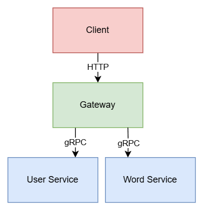

The **Proxima Notebook** is a lightweight application designed to help users learn English vocabulary. It includes the following features:
- User registration
- User login
- User information queries
- Word management (CRUD operations)

We've organized these features into logical groups, resulting in two microservices:
- User Service: Handles user registration, login, and information queries
- Word Service: Provides word-related functionality, such as CRUD operations

Rather than exposing microservices directly, all requests are routed through an API gateway. The gateway operates as a web service that doesn't implement business logic directly. Instead, it receives requests, forwards them to appropriate microservices, and aggregates responses to complete business operations.

The gateway's responsibilities extend beyond protocol translation, including:
- Load balancing
- Authentication and authorization
- Logging
- Monitoring
- Rate limiting

Microservices typically communicate using either HTTP or gRPC protocols. In this project, we'll be using gRPC.

## Code Repository
---
When breaking down a monolithic service into microservices, the code naturally separates as well. There are two common approaches to managing the code repository:

- **Multirepo:** Each microservice has its own repository. 
  - Advantages: Smaller, more manageable repositories
  - Disadvantages: Requires additional tools and processes to coordinate dependencies and versions between services

- **Monorepo:** All microservices code lives in a single repository.
  - Advantages: Unified version and dependency management
  - Disadvantages: Repository can become large and complex to manage

Our project uses the `Monorepo` approach. The `Multirepo` approach, with its one-service-per-directory structure, is straightforward enough to not require further explanation.
