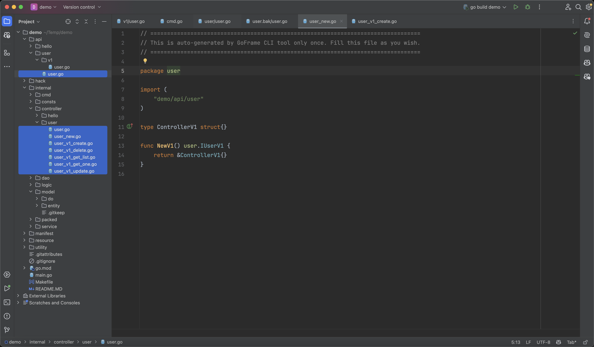

## Generate Codes From API Definition

Once the `api` definition is completed, we generate the controller code through the `make ctrl` command (or `gf gen ctrl`).

```text
$ make ctrl
generated: /Users/john/Temp/demo/api/user/user.go
generated: /Users/john/Temp/demo/internal/controller/user/user.go
generated: /Users/john/Temp/demo/internal/controller/user/user_new.go
generated: /Users/john/Temp/demo/internal/controller/user/user_v1_create.go
generated: /Users/john/Temp/demo/internal/controller/user/user_v1_update.go
generated: /Users/john/Temp/demo/internal/controller/user/user_v1_delete.go
generated: /Users/john/Temp/demo/internal/controller/user/user_v1_get_one.go
generated: /Users/john/Temp/demo/internal/controller/user/user_v1_get_list.go
done!
```



The generated codes mainly include `3` types of files.

## Abstraction API For API

Defines the `api API` to ensure the completeness of the controller's API implementation, avoiding issues of missing API implementations in `controller`. Since `GoFrame` is a rigorous development framework, it controls such details well. Whether or not this feature is used by developers can be decided based on specific scenarios and needs.

```text
/Users/john/Temp/demo/api/user/user.go
```

This file is maintained by the development tool, and developers do not need to worry about it.

Content is as follows:
```go title="api/user/user.go"
// =================================================================================
// Code generated and maintained by GoFrame CLI tool. DO NOT EDIT.
// =================================================================================

package user

import (
    "context"

    "demo/api/user/v1"
)

type IUserV1 interface {
    Create(ctx context.Context, req *v1.CreateReq) (res *v1.CreateRes, err error)
    Update(ctx context.Context, req *v1.UpdateReq) (res *v1.UpdateRes, err error)
    Delete(ctx context.Context, req *v1.DeleteReq) (res *v1.DeleteRes, err error)
    GetOne(ctx context.Context, req *v1.GetOneReq) (res *v1.GetOneRes, err error)
    GetList(ctx context.Context, req *v1.GetListReq) (res *v1.GetListRes, err error)
}
```

## Controller Router Object

Used to manage the initialization of the controller, as well as data structures and constant definitions used internally by the control.

```text
generated: /Users/john/Temp/demo/internal/controller/user/user.go
generated: /Users/john/Temp/demo/internal/controller/user/user_new.go
```

Among them, `internal/controller/user/user.go` is an empty source file, which can be used to define data structures, constants, and other content used by the controller internally.
```go title="internal/controller/user/user.go"
// =================================================================================
// This is auto-generated by GoFrame CLI tool only once. Fill this file as you wish.
// =================================================================================

package user

```

Another file `internal/controller/user/user_new.go` is an auto-generated route object creation file.
```go title="internal/controller/user/user_new.go"
// =================================================================================
// This is auto-generated by GoFrame CLI tool only once. Fill this file as you wish.
// =================================================================================

package user

import (
    "demo/api/user"
)

type ControllerV1 struct{}

func NewV1() user.IUserV1 {
    return &ControllerV1{}
}
```
Both of these files will only be generated once, after which developers can freely modify and extend them.

:::tip
If later we need to define a `v2` API, the `make ctrl` command will similarly generate a `type ControllerV2 struct{}` structure definition and a `func NewV2() user.IUserV2` initialization method.
:::

## Controller Router Implementation

Used for the implementation code files of specific `api` APIs. By default, codes are generated in the form of one source file per `api` API. Of course, it is also possible to control the aggregation of APIs defined in `api` files into a corresponding single source file. For specific command introductions and configurations, please refer to the chapter [Controller Generating](../../../docs/开发工具/代码生成-gen/接口规范-gen%20ctrl.md).

```text
generated: /Users/john/Temp/demo/internal/controller/user/user_v1_create.go
generated: /Users/john/Temp/demo/internal/controller/user/user_v1_update.go
generated: /Users/john/Temp/demo/internal/controller/user/user_v1_delete.go
generated: /Users/john/Temp/demo/internal/controller/user/user_v1_get_one.go
generated: /Users/john/Temp/demo/internal/controller/user/user_v1_get_list.go
```

Let's open one of the files to view the generated code template:

```go title="internal/controller/user/user_v1_create.go"
package user

import (
    "context"

    "github.com/gogf/gf/v2/errors/gcode"
    "github.com/gogf/gf/v2/errors/gerror"

    "demo/api/user/v1"
)

func (c *ControllerV1) Create(ctx context.Context, req *v1.CreateReq) (res *v1.CreateRes, err error) {
    return nil, gerror.NewCode(gcode.CodeNotImplemented)
}
```
As we can see, this is just the implementation template for the create API we defined. We just need to complete the specific business logic of this route function.

## Learning Summary

Example source code for this chapter: https://github.com/gogf/quick-demo/tree/main/internal/controller/user

The `GoFrame` scaffolding tool helps us generate all the code unrelated to business logic. We only need to focus on the implementation of the business logic. Moreover, these auto-generated code files are mostly fully maintained by the tool, except for a few code files that developers can extend, thus we do not need to worry about their future maintenance.

Yes, the goal of the `GoFrame` scaffolding tool is to allow developers to focus on the business logic itself, while all work other than business logic is handled by the development framework and scaffolding tool.

Such a development method is extremely convenient, not too comfortable! Do you think that’s all? Of course not, in the Quick Start chapter we only introduce some beginner-level features. When you delve deeper into her, you will discover more of her goodness and her understanding nature.

Next, we will complete the business logic implementation of the API and feel the charm of the `GoFrame` database `ORM` component.