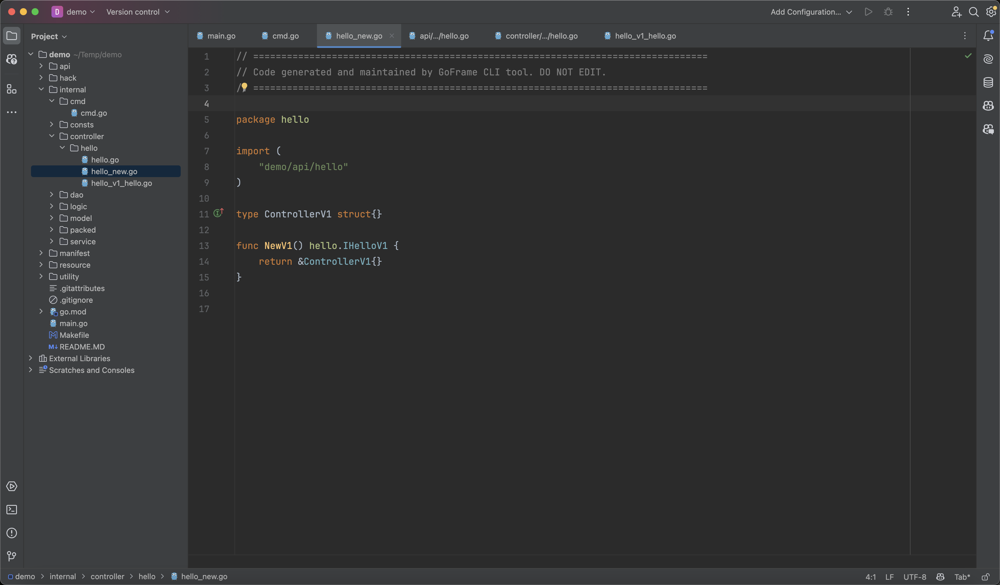

New to the project structure? Don't worry! This chapter builds on our [Project Structure Guide🔥](../../docs/框架设计/工程开发设计/工程目录设计.md) to explain how your application starts up and how different components work together.

## The Main Entry Point

Every GoFrame application begins with `main.go`. This file delegates to the `internal/cmd` package to orchestrate the application startup. In our project template, it specifically calls the `Run` command of the `Main` object in the `internal/cmd` package.

All core business logic resides in the `internal` directory - a Go feature that prevents external packages from importing these files, enhancing security and maintaining clean architecture.

:::tip
Framework core components require a `context` parameter. We use `gctx.GetInitCtx` to inherit trace information from the parent process. If no parent process exists, it creates a new context with tracing capabilities for downstream operations.
:::


## Bootstrap Process

The `Main` object's `Run` command handles bootstrap initialization, where you can place dynamic startup logic. By default, our template:
1. Creates an HTTP server
2. Registers routes using group routing
3. Starts the HTTP server
4. Blocks for incoming requests while monitoring system signals
5. Gracefully shuts down when receiving exit signals

:::tip
For detailed command-line management information, see: [Command Management](../../docs/核心组件/命令管理/命令管理.md)
:::


## Configuring Routes

The template uses group routing via the `Group` method - one of several routing approaches supported by GoFrame's HTTP server.

```go
s := g.Server()
s.Group("/", func(group *ghttp.RouterGroup) {
    group.Middleware(ghttp.MiddlewareHandlerResponse)
    group.Bind(
        hello.NewV1(),
    )
})
```

This setup:
- Registers a middleware using `Middleware` to standardize route responses
- Binds route objects returned by `hello.NewV1()` using the `Bind` method
- Automatically registers all public methods of the route object
- Supports API versioning (default version is `v1`)

:::tip
For comprehensive routing documentation, see: [Router Guide 🔥](../../docs/WEB服务开发/路由管理/路由管理.md)
:::

## Route Objects


### Creating Route Objects
Let's look at how `hello.NewV1()` works:



Notice it returns an API interface rather than a concrete object:


Why use an interface instead of returning the `ControllerV1` object directly?

This design enables early error detection. If your `controller` doesn't implement all required API methods, you'll get compilation errors and IDE warnings, rather than runtime failures.

:::tip
- This pattern is optional but recommended for robust code organization
- Most of this code can be auto-generated using the `gf gen ctrl` command based on API definitions
:::

### Defining Route Handlers
Here's a typical route handler:


Route parameters are defined in the `HelloReq` input object:


:::tip
This approach of using middleware for standardized responses and route objects is called **standardized routing**.
Learn more in our [Standard Router Guide](../../docs/WEB服务开发/路由管理/路由管理-路由注册/路由注册-规范路由/路由注册-规范路由.md).
:::

## Running Your Application

### Server Operation

The HTTP server starts with the `Run` method, which:
- Blocks for incoming requests
- Monitors process signals
- Handles server restart/shutdown

You'll see this output on startup:


Notice that API documentation and Swagger UI are automatically enabled.

### Testing the API

Visit http://127.0.0.1:8000/hello to test the API:


Access the API documentation at http://127.0.0.1:8000/swagger:


## Chapter Summary

You now understand how a GoFrame application bootstraps and runs. While we've covered the basics, there's much more to explore in our detailed documentation.

Next, we'll build a complete CRUD API using this template, implementing database operations for creating, reading, updating, and deleting records.